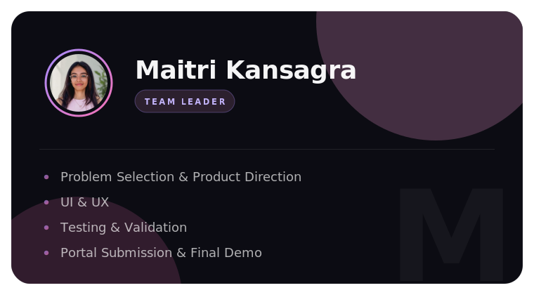
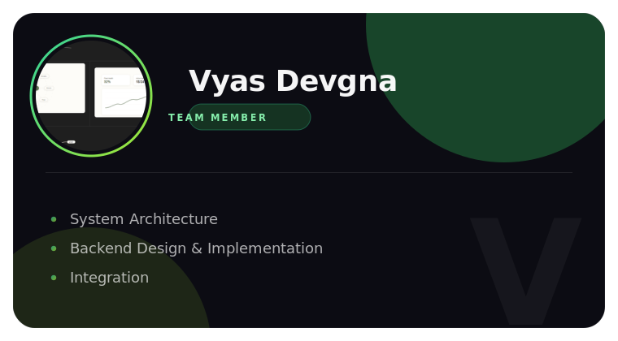
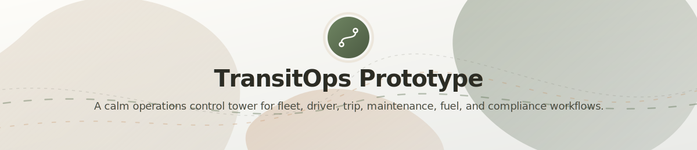
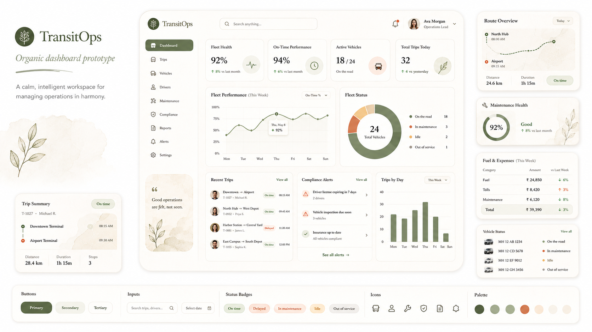

<!-- ═══════════════════════════════ HERO ═══════════════════════════════ -->

  <picture>
    <source media="(prefers-color-scheme: dark)" srcset="assets/hero-dark.svg" />
    
  </picture>

 

 

<!-- ═══════════════════════════════ TEAM ═══════════════════════════════ -->

  <h2>👥 Meet the Team</h2>
  
  
   
  
     
  
  
   
  
    

 

  

 

<!-- ═══════════════════════════════ OVERVIEW ═══════════════════════════════ -->

  <h2>🎯 Project Overview</h2>

> [!NOTE]
> **TransitOps — Smart Transport Operations Platform.** Our Odoo Hackathon 2026 virtual-round submission.

Logistics teams still run their fleets on spreadsheets and paper logbooks, which quietly cause scheduling clashes, idle vehicles, missed maintenance, expired driver licenses, and murky costs. 

**TransitOps** replaces that with one platform for the full transport lifecycle — vehicles, drivers, dispatch, maintenance, fuel, and expenses — with business rules enforced automatically and operational insight on a live dashboard.

   
  <table>
    <tr>
      <td align="center">👔 <b>Fleet Manager</b></td>
      <td align="center">🚚 <b>Driver / Dispatcher</b></td>
      <td align="center">🛡️ <b>Safety Officer</b></td>
      <td align="center">📈 <b>Financial Analyst</b></td>
    </tr>
  </table>
  
<em>Each role features bespoke, role-based access to the tools they need.</em>

 

  

 

<!-- ═══════════════════════════ DESIGN SHOWCASE ═══════════════════════════ -->

  <h2>✨ Design Showcase</h2>

  

TransitOps uses an organic, calm, operations-focused design language: soft rice-paper surfaces, moss green actions, terracotta accents, rounded dashboard cards, natural motion, and generous whitespace. The interface direction is designed to make complex transport operations feel composed, readable, and human.

  

  

### Visual Direction

- Organic dashboard layout with calm, high-density operational visibility.
- Moss green primary actions, terracotta secondary accents, rice-paper surfaces, and soft timber borders.
- Rounded cards, pill controls, tactile status badges, botanical details, and subtle motion.
- Main focus: dashboard clarity, smart dispatch readiness, compliance visibility, analytics, and operational control.

> This showcase represents the intended visual direction before full product development begins.

 

  

 

<!-- ══════════════════════════════ TECH STACK ══════════════════════════════ -->

  <h2>⚡ Tech Stack</h2>
  
A lightweight, locally runnable hackathon POC with a minimal full-stack architecture.

  
  

    
    
    
    
    
    
  

 

### 🛠️ Core Technologies

| Layer | Technology | Purpose |
| :--- | :--- | :--- |
| **Framework** | Next.js App Router | Full-stack app routing, pages, server actions/API routes |
| **Language** | TypeScript | Type-safe business logic, UI, and model interfaces |
| **Database** | SQLite | Lightweight local database for easy testing and demos |
| **ORM** | Prisma | Schema modelling, migrations, queries, and seed data |
| **Auth/RBAC** | Custom Credentials | DB-backed users, roles, and permissions |
| **UI** | Tailwind CSS + shadcn/ui | Dark responsive dashboard UI |
| **Charts** | Recharts | KPI and analytics visualizations |
| **PDF** | `@react-pdf/renderer` | Structured report PDF generation |
| **CSV** | Server-side export | Data exports for fleet, trips, and expenses |
| **Media** | DB-backed storage | Uploaded documents, licences, receipts (no local FS) |
| **Validation** | Zod + Service Layer | Form validation and strict business rules |
| **Icons** | lucide-react | Navigation and UI icons |
| **Deployment** | Docker | Containerized deployment and easy runner setup |

 

### 💡 Why this stack?
- **Intentionally minimal** for a hackathon POC.
- **Avoids extra infrastructure** like separate backend servers, cloud storage, or hosted databases.
- **SQLite + Prisma** keeps the app trivial to run locally while supporting relational data.
- **Full lifecycle support** for RBAC, vehicles, drivers, trips, maintenance, and analytics.
- **Easy to demo**, test, and record locally.

 

  

 

<!-- ═══════════════════════════ SUBMISSION STANDARD ═══════════════════════════ -->

  <h2>🏆 Submission Standard</h2>

> [!IMPORTANT]
> The final repository will contain only reviewer-relevant material to ensure a perfect presentation.

| &nbsp; | What reviewers will find here |
| :---: | :--- |
| 📦 | **Source code** required to run the solution |
| 🧭 | A precise **problem and solution narrative** |
| ⚙️ | **Reproducible** setup and demo instructions |
| 🏗️ | **Architecture** and data-flow documentation |
| ✅ | **Validation**, error handling, and test evidence |
| 📈 | **Meaningful commit history** from both team members |
| 🖼️ | **Screenshots** or a short demo link when available |

 

<!-- ═══════════════════════════════ FOOTER ═══════════════════════════════ -->

  

